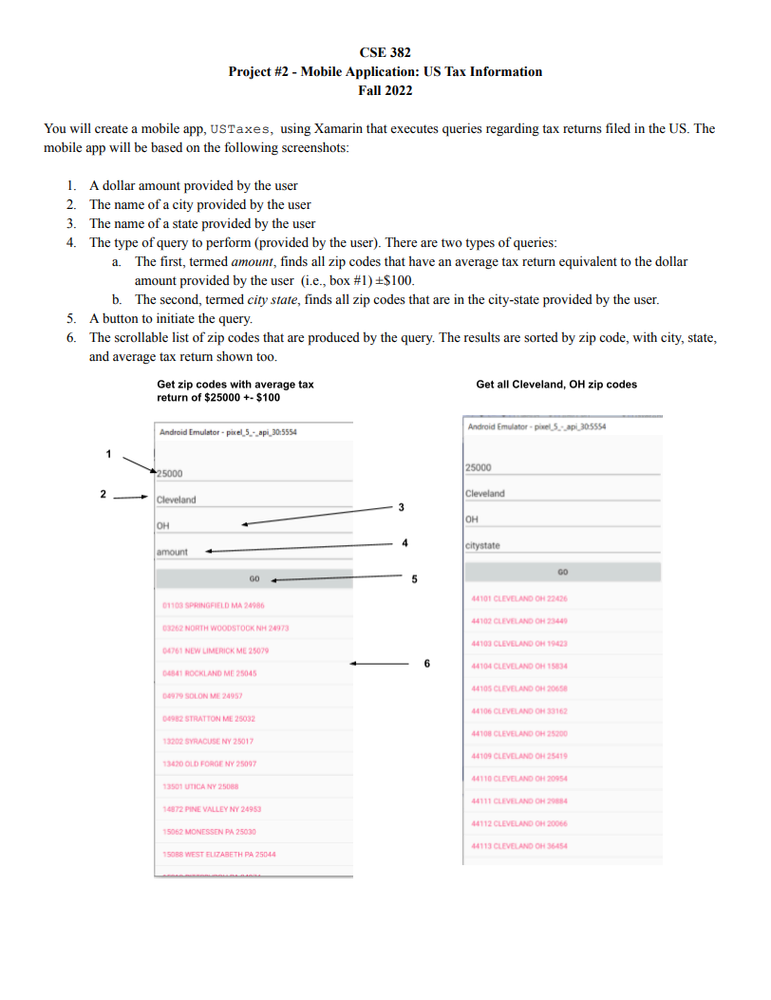
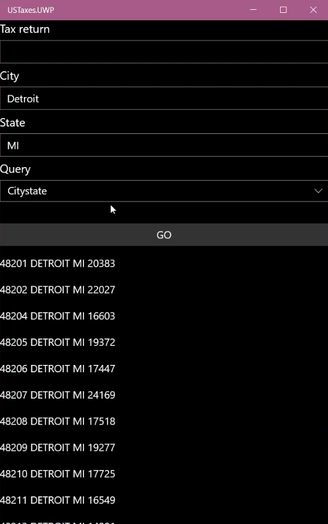
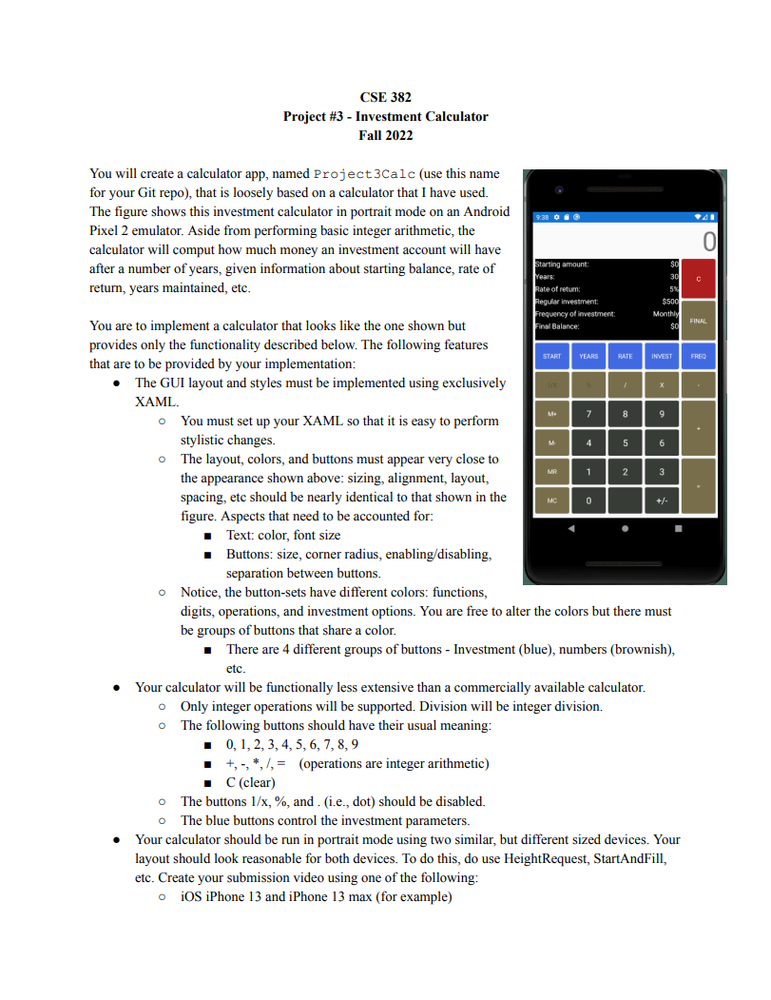
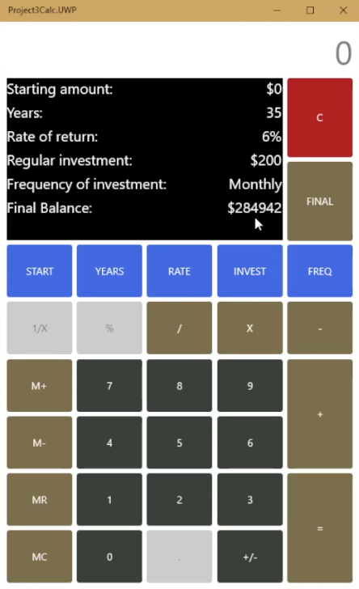
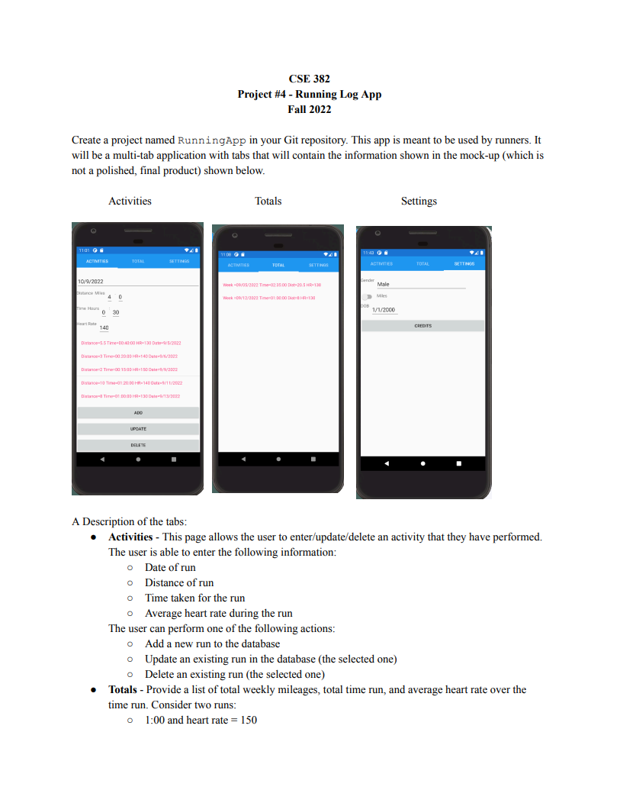
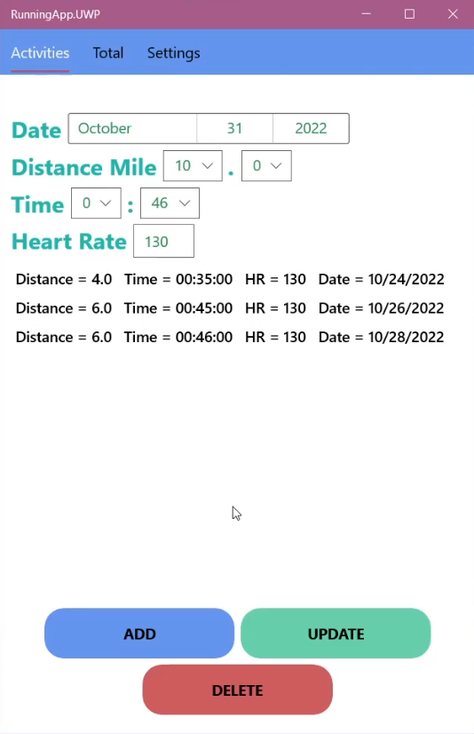
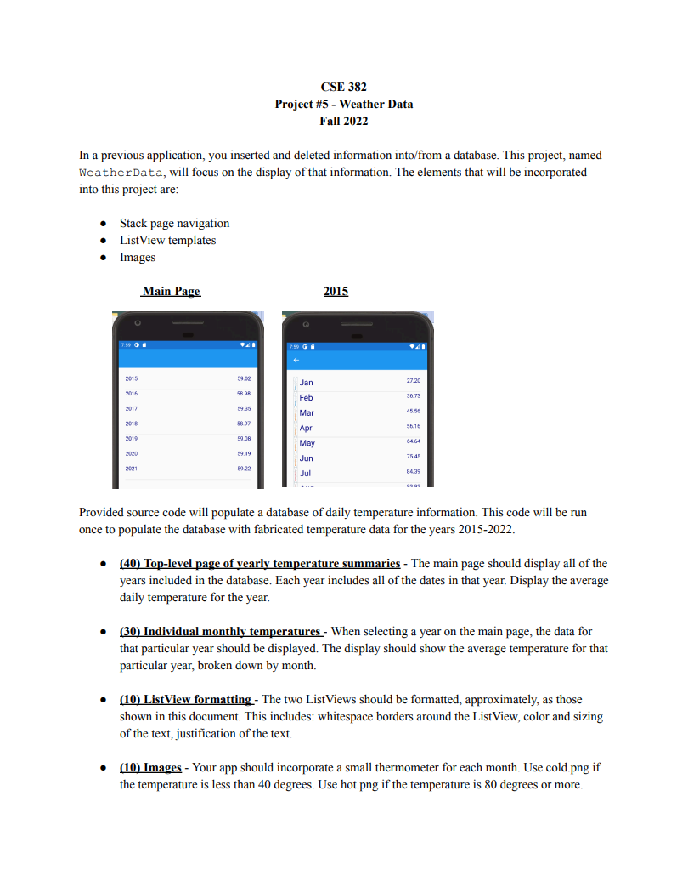
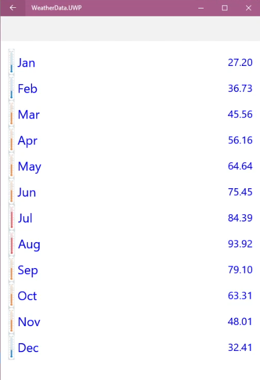
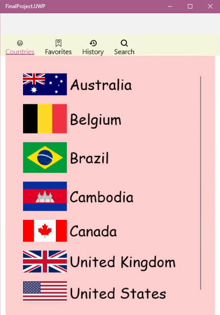
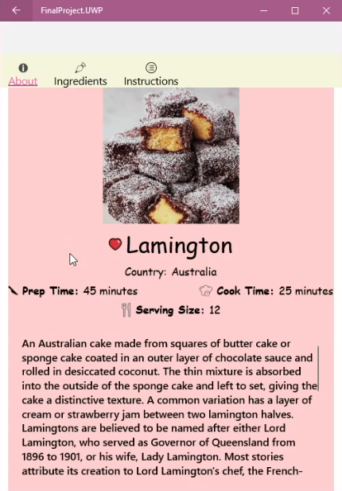

# My CSE382 Projects – 2022
Projects developed as part of the **Mobile App Development** course.

## About
This repository contains the **5 assigned projects** and my **final project**.

Unfortunately Microsoft has decided to discontinue support for Xamarin as of **May 1, 2024**.

## Project 1 – USLocations
**Assignment Goal:**
Create 2 console apps called Distance and Common. Distance will allow the user to type in 2 legal zipcodes and determine the distance between the two locations. Common will allow the user to type in two legal state abbreviations and return all city names that are located in both states in alphabetical order.

## Project 2 – USTaxes
**Assignment Goal:**
Create a mobile app that returns a list of queries regarding tax returns filed in the US.

**Screenshots:**

|     Assignment     | My Project |
|--------------------|------------|
|  |  |

## Project 3 – Project3Calc
**Assignment Goal:**
Create a calculator app that also computes how much money an investment account will have after a number of years.

**Screenshots:**

|     Assignment     | My Project |
|--------------------|------------|
|  |  |

## Project 4 – RunningApp
**Assignment Goal:**
Create a runnning app that allows the user to track the distance they've ran with how long and what their heartbeat was. It would also include a list of total weekly mileages, total time, average heart rate over the time ran, and a settings section for the user.

**Screenshots:**

|     Assignment     | My Project |
|--------------------|------------|
|  |  |

## Project 5 – WeatherData
**Assignment Goal:**
Create a weather data app that displays a list from 2015 – 2022 and includes the average temperatures within those years. Upon selecting a year, display a list of the months and their average temperatures.

**Screenshots:**

|     Assignment     | My Project |
|--------------------|------------|
|  |  |

## Final Project – Dessert Showcase
**Assignment Goal:**
Create a final project that incorporates many of the techniques learned throughout the course. Must include all required features given and at least 3 secondary features. The purpose of this final project was to create a highly polished app that we have a personal interest in.

**My Approach:**
For my final project, I chose to develop a mobile app called **Dessert Showcase**. This app allows users to search for and favorite desserts from various countries. When a dessert is selected, users can view a brief history, access its recipe, and add it to their favorites. A soft chime plays each time a dessert is liked or unliked, enhancing the user experience with subtle audio feedback.

The required features to include were a local database, multiple pages, ListView, and Images. The 3 secondary features I chose were meaningful user preferences, layout changes based on phone vs tablet or portrait vs landscape, and sound.

**Screenshots:**

| Small List of Random Countries | Example of Selecting a Dessert from a Country |
|--------------------------------|-----------------------------------------------|
|  |  |  
